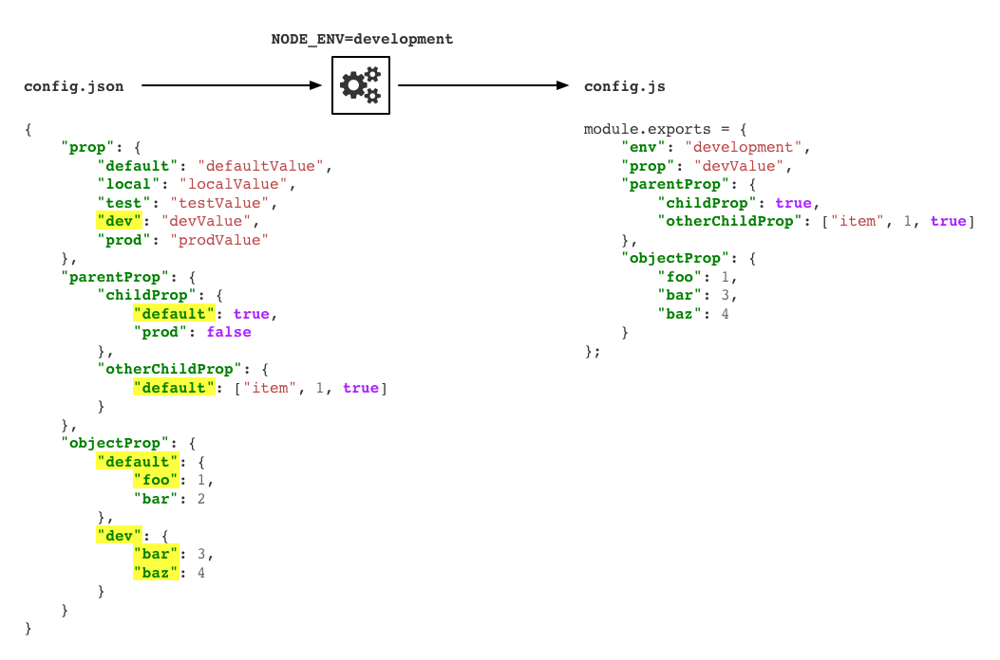

# Single Config

[](https://travis-ci.org/smnh/single-config)
[](https://coveralls.io/github/smnh/single-config)
[]()

Small Node.js script that generates configuration model, based on the
value of NODE_ENV, from a single JSON configuration file which specifies
configuration values for all possible environments.




## Why

1. To easily maintain and quickly identify all possible configuration
   values among different environments. I find it less convenient to
   have configuration scattered between different configuration files
   (e.g.: `config.js`, `config.local.js`, `config.dev.js`, etc.).
   Instead, having all configuration in one place make it less likely to
   miss some configuration property.
2. Built configuration is a module exporting object with own enumerated
   properties. Therefore, auto-complete in advanced IDEs such as
   WebStorm work out-of-the-box. No need to write
   `config.get('parent.child')`, just `config.parent.child`.


## Usage

`config.json`

```json
{
    "myProp": {
        "default": "myDefaultValue",
        "local": "myLocalValue",
        "dev": "myDevValue",
        "prod": "myProdValue"
    },
    "parentProp": {
        "childProp": {
            "local": false,
            "dev": true,
            "prod": false
        },
        "otherChildProp": {
            "default": ["item", 1, true]
        }
    },
    "myObject": {
        "default": {
            "foo": 1,
            "bar": 2
        },
        "dev": {
            "bar": 3,
            "foobar": 4
        }
    }
}
```

`$ NODE_ENV=development buildconfig --input=./config.json --output=./config.js`

> In the above example the `--input` and the `--output` arguments are
  redundant as they have been set to their default values.

`config.js`

```javascript
// This file was automatically generated at <ISO_DATE>
module.exports = {
    "env": "development",
    "myProp": "myDevValue",
    "parentProp": {
        "childProp": true,
        "otherChildProp": ["item", 1, true]
    },
    "myObject": {
        "foo": 1,
        "bar": 3,
        "foobar": 4
    }
};
```

Using the configuration in application modules:

```javascript
const config = require('./config');
console.assert(config.parentProp.childProp);
```


## buildconfig Arguments

- `input`: The file path of the input json relative to the current working directory, default: ./config.json
- `output`: The file path of the output module relative to the current working directory, default: ./config.js
- `envSelectors`: TBD - not implemented yet (override or add new environment selectors, except `default`)


## Environment selectors

- `default`: used if no other sibling selectors match `NODE_ENV`
- `local`: used if `NODE_ENV` is `local`
- `dev`: used if `NODE_ENV` is `development`
- `prod`: used if `NODE_ENV` is `production`
- `test`: used if `NODE_ENV` is `test`

> Matching selectors for `development` and `production` are `dev` and
  `prod` respectively. This is to allow using the shorter versions
  inside configuration json.

> Omitting `default` will throw an error if the build script will not
  find selector matching the current `NODE_ENV`. Therefore, not using
  `default` is a good way to enforce writing selectors for every
  environment.


## Environment selectors level

The environment selectors can appear at any level of the configuration
json. The only restriction is that once the environment selector is used
all other sibling nodes at this level must also be environment selectors.

`config.json`

```json
{
    "simpleValue": {
        "default": "hello",
        "prod": "world"
    },
    "object": {
        "nestedValue": {
            "default": "foo",
            "dev": "bar",
            "prod": "foobar"
        }
    }
}
```

`$ NODE_ENV=development buildconfig`

```javascript
const config = require('./config');
console.assert(config.simpleValue === "hello");
console.assert(config.object.nestedValue === "bar");
```


## Selected values can be any JSON supported types

```json
{
    "simpleValue": {
        "local": {
            "property": true,
            "foo": "bar"
        },
        "dev": {
            "property": false,
            "arr": ["item", 2]
        },
        "prod": "does not have to be same type as local or dev"
    }
}
```

It is generally suggested to use environment selectors as the last nesting
level that references scalar values instead of nested objects. This allows
better visual comparison between environment values. After all, this was
the main idea behind this kind of configuration management - "To easily
maintain and quickly identify all possible configuration values among
different environments".

Another advantage of doing this is making sure that all properties where
defined for the current environment (if `default` was not defined).

Therefore, instead of doing this:

```json
{
    "parentProp": {
        "dev": {
            "childProp1": true,
            "childProp2": "foo"
        },
        "dev": {
            "childProp1": false,
            "childProp2": "bar"
        }
    }
}
```

do this:

```json
{
    "parentProp": {
        "childProp1": {
            "dev": true,
            "prod": false
        },
        "childProp2": {
            "dev": "foo",
            "prod": "bar"
        }
    }
}
```

If object is used for both `default` and current `NODE_ENV` selectors,
its properties will be shallowly merged:
`Object.assign({}, obj['default'], obj[NODE_ENV])`.


## Configuration JSON Restriction

The build script checks for the following restrictions and will throw an
error if one of them is not fulfilled.

- Configuration property names can not use environment selectors:
  `default`, `local`, `dev`, `test`, `prod`. Although objects referenced
  by environment selectors can have such properties.
- Environment selector level must have the current `NODE_ENV` or
  the `default` selector. For this reason, it is suggested not to use
  `default` selector to ensure that every environment has its own
  configuration value.
- Environment selector level must include only environment selectors. If
  environment selector is used, then all its sibling nodes must be
  environment selectors as well.
- Environment selectors must appear at some level of any branch of the
  configuration json.
